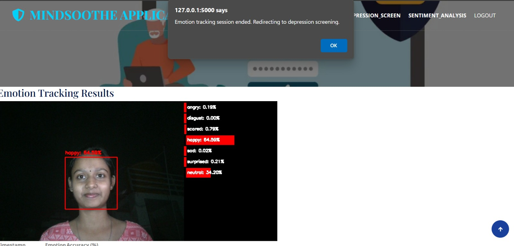
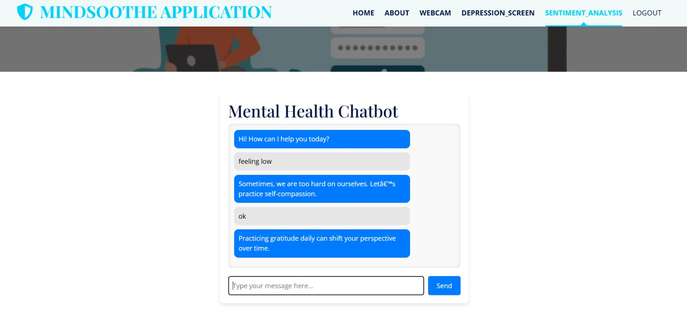
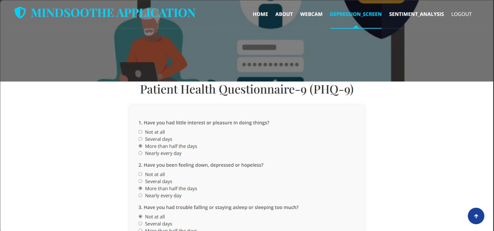

# 🧠 MINDSOOTHE_APPLICATION

**MINDSOOTHE_APPLICATION** is an intelligent mental health companion designed to offer preliminary support, detect emotional patterns, and recommend helpful content using AI and machine learning. The app provides a safe space for users to express their feelings, understand their mental health better, and get personalized suggestions.

---

## 🚀 Features

- 🧭 Sentiment Analysis using NLP
- 🎤 Voice input support
- 🤖 Pre-trained ML model for emotion classification
- 🧘‍♀️ Personalized mental wellness suggestions
- 🗂️ Clean, responsive UI

---

## 📸 Screenshots

---

